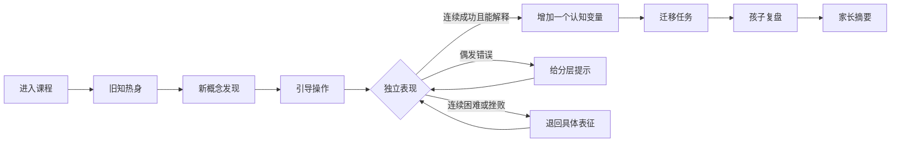

# 课程产品蓝图

## 1. 课程目标

### 1.1 一年后的理想表现

孩子能够：

- 在新问题中先观察、再尝试，而不是等待成人给答案
- 按一个或两个属性分类，并能改变规则重新分类
- 发现、延续、创造和解释多种模式
- 理解10以内数量关系，逐步探索20以内数感和简单加减情境
- 比较和测量长度、容量、重量、时间，读懂简单图表
- 识别、组合、拆分、旋转和想象二维/三维图形
- 使用排除、对应、逆向、尝试与检查等策略解决问题
- 记住2–3条规则，在规则变化时灵活切换
- 用完整句子说明“我发现了什么、我为什么这样选、还能怎么做”
- 把屏幕中的方法迁移到积木、玩具、路线、分配等真实生活场景

### 1.2 不作为目标

- 追求口算速度、刷题量或同龄排名
- 提前背诵小学公式
- 用动画、金币和盲盒替代学习动机
- 把所有能力压成一个“智力分数”
- 根据单次表现给孩子贴“聪明/不聪明”的标签

## 2. 能力地图

| 能力域 | 子能力 | 起步表现 | 进阶表现 |
|---|---|---|---|
| A 执行功能 | 选择性注意、工作记忆、抑制控制、规则切换、计划 | 记住1–2步；按单一规则行动 | 记住3步；在两套规则间切换；先计划再行动 |
| B 集合与分类 | 配对、归类、包含关系、多属性分类 | 按颜色/形状等单属性分类 | 同一组物体用不同规则分类；理解“属于/不属于” |
| C 模式与关系 | 重复、增长、对应、排序、类比 | 续接AB/ABB模式 | 解释单元；迁移模式；探索ABC、AAB、增长模式 |
| D 数感与运算 | 点数、基数、守恒、比较、合成分解、加减情境 | 稳定点数10以内并匹配数量 | 灵活分解10；用多种策略解决简单加减问题 |
| E 量、测量与数据 | 长度、重量、容量、时间、排序、图表 | 直接比较并使用非标准单位 | 选择单位、估测、记录和解释简单数据 |
| F 图形与空间 | 图形属性、拼拆、方位、旋转、视角、三维 | 识别常见图形和位置词 | 组合拆分、心理旋转、地图路线和不同视角 |
| G 逻辑与问题解决 | 排除、条件、对应、逆向、策略、验证 | 根据一个线索选择 | 综合2–3条线索；比较策略；发现反例 |
| H 科学与计算思维 | 观察、预测、因果、实验、分解、顺序、循环、纠错 | 描述现象并做简单预测 | 控制一个变量；编排步骤；发现并修正错误 |
| I 元认知与表达 | 描述、解释、反思、迁移、坚持 | 说出选择 | 说明证据、比较方法、表达不确定性并复盘 |

I域不单独授课，而是嵌入每一节课。

## 3. 分级体系

不在儿童端显示“4岁级、5岁级”。每个子能力使用5级：

| 等级 | 含义 | 题目特征 |
|---|---|---|
| L0 探索 | 尚未稳定理解 | 单规则、实物感强、示范充分 |
| L1 建立 | 能在提示下完成 | 单一变化、2–3个选项 |
| L2 稳定 | 能独立完成典型任务 | 换素材但结构相同 |
| L3 迁移 | 能在新情境中使用 | 增加干扰项、改变表征 |
| L4 创造 | 能解释、创造或比较策略 | 开放题、多解题、反例题 |

高认知儿童可以在某些能力达到L3，同时在抑制控制、精细操作或语言表达上仍处于L1。系统必须保存“能力画像”，不能只给一个总级别。

## 4. 首次诊断

### 4.1 形式

- 分3天完成，每天10–12分钟
- 每天6–8个游戏任务
- 从中等难度开始，根据表现上下探测
- 不告诉孩子“考试”，包装为“帮机器人修好探险船”
- 家长只负责环境与情绪支持，不提示答案

### 4.2 诊断模块

1. 分类与规则切换
2. 模式与序列
3. 数量、比较与分解
4. 图形拼合、旋转与方位
5. 线索排除和步骤规划
6. 工作记忆与抑制控制
7. 口头解释与迁移

### 4.3 输出

- 雷达式能力画像（仅家长端）
- 每项“当前能独立完成”“在提示下能完成”“下一步”
- 推荐起始节点
- 需要观察但不做诊断的提示，例如：语音理解、颜色辨别、视听疲劳、精细动作

## 5. 单课完整逻辑

每课15–20分钟，最多6个屏幕场景。

| 环节 | 时长 | 作用 | 示例 |
|---|---:|---|---|
| 1. 唤醒 | 1–2分钟 | 注意与旧知提取 | “昨天的规则还记得吗？” |
| 2. 发现 | 3分钟 | 用故事冲突引出目标 | 两辆车装错了货物，请孩子找规律 |
| 3. 操作 | 4–5分钟 | 拖、摆、连、画、说 | 自己移动对象，立即看到结构变化 |
| 4. 挑战 | 4–5分钟 | 新表征或多一步推理 | 从彩珠模式迁移到声音模式 |
| 5. 解释 | 2分钟 | 说出理由、比较方法 | “你是从哪里看出来的？” |
| 6. 迁移 | 2–4分钟 | 离屏行动 | 找出家中3样能滚动的东西并验证 |

### 5.1 课堂状态机



## 6. 题目与交互类型

### 6.1 推荐交互

- 拖拽分类：把对象放入不同集合
- 排序与插空：按长短、事件先后或规律排列
- 路线规划：先摆箭头，再运行角色
- 图形拼拆：七巧板式、轮廓填充、切割与重组
- 心理旋转：先预测，再转动物体验证
- 天平与容器模拟：比较、估测后操作
- 线索板：逐条打开线索并排除选项
- 找错与调试：定位错误步骤并修改
- 录音解释：儿童说理由，家长可回听
- 开放创造：自己创建一种分类、模式或路线
- 离屏拍照：记录家中找到的例子

### 6.2 不推荐交互

- 只靠快速点击的“打地鼠”
- 与学习目标无关的装扮、金币雨、抽奖
- 倒计时制造压力
- 错误后立刻给出正确答案
- 连续10题以上同构刷题
- 需要精细小目标点击的界面
- 大段文字或长动画讲解
- 把“拖对了”误判为“理解了”

## 7. 提示系统

同一道题最多三级提示：

1. 关注提示：指出需要观察的区域，不透露规则  
   例：“看看每一排中间发生了什么。”
2. 表征提示：减少干扰或把抽象关系变成可操作对象  
   例：“把两个一组圈起来试试。”
3. 示范提示：演示第一步，剩余部分由孩子完成  
   例：“我先把红色放这里，下一块你来。”

仍未完成时，不显示失败；进入“我们一起试”，然后安排一道更具体、更简单的变式。系统记录“在三级提示下完成”，不能记为独立掌握。

## 8. 自适应机制

### 8.1 每次作答记录

- 正确性
- 是否独立
- 使用了哪一级提示
- 是否自我纠错
- 能否口头解释
- 是否迁移成功
- 情绪/投入：主动、平稳、犹豫、挫败、退出

反应速度只用于发现走神或界面问题，不作为能力高低的主要依据。

### 8.2 升降规则

- 目标成功区间：独立正确率约70%–85%
- 升级：最近5次中至少4次独立完成，并在不同素材中成功，至少1次能解释
- 保持：能完成但依赖一级提示，继续同结构异素材
- 回退表征：连续2次需要二/三级提示，改用更具体的操作
- 暂停：出现明显挫败、乱点或拒绝，先换到已掌握的轻任务，再结束
- 真正掌握：相隔至少7天，在新情境中再次独立完成

### 8.3 高认知儿童的特别规则

- 允许跳过已掌握的重复练习
- 升难度优先增加“关系数、规则切换、解释和多解”，而不是扩大数字
- 同一能力可横向迁移到声音、动作、故事、积木和地图
- 不因数数到100就直接进入竖式计算
- 当答案很快时追加“你能找第二种方法吗”，而不是追加十道同题

## 9. 内容生产模型

每个学习节点由以下结构描述：

```yaml
skill_id: C-PATTERN-AB-01
title: 发现重复单元
prerequisites:
  - B-MATCH-01
level: L1
learning_goal: 能发现并续接AB重复模式
representations:
  - concrete
  - pictorial
  - auditory
interaction: drag_sequence
difficulty_variables:
  sequence_length: [4, 6, 8]
  distractors: [0, 1, 2]
  pattern_types: [AB, AAB, ABB]
prompts:
  attention: 找一找一直重复的那一小段
  representation: 把它们两个两个圈起来
  model: 我先放红色，接下来轮到什么？
explanation_prompt: 你发现哪一段在重复？
offline_transfer: 用勺子和杯子摆出同样的规律
mastery_evidence:
  - independent_success
  - cross_context_success
  - verbal_explanation
```

## 10. 家长端闭环

### 10.1 每课后只展示三件事

- 今天练了什么：例如“在两条线索下做排除”
- 孩子怎样思考：例如“能独立找到答案，但解释时需要追问”
- 生活中怎么继续：一个5分钟以内的家庭游戏

### 10.2 每4周报告

- 各能力的进展证据，不给同龄排名
- “独立完成/提示完成/尚在探索”的变化
- 最喜欢与最容易挫败的任务类型
- 下月个性化重点
- 2–3段儿童原声或作品作为成长档案

### 10.3 家长提问脚本

推荐：

- “你注意到了什么？”
- “你为什么这样想？”
- “还有别的办法吗？”
- “怎样检查一下？”
- “如果把规则换掉，会发生什么？”

避免：

- “这么简单怎么还不会？”
- “你看，应该放这里。”
- “快一点。”
- “你真聪明。”

更好的反馈是：“你刚才换了一个办法，而且检查出了错误。”

## 11. 安全与儿童体验

- 儿童端无广告、无外链、无聊天、无公开排行
- 默认不采集儿童面部；录音和照片由家长明确开启
- 所有数据可导出、可删除
- 大触控目标、低视觉噪声、语音与图示并行
- 可关闭音乐、动画和角色语音
- 每5–7分钟有一次姿势变化或离屏动作
- 单课到时自然收束，不用“再玩一局”诱导延长
- 若家庭当天其他屏幕时间较多，可只做离屏任务

## 12. 开发优先级

### MVP（首月）

- 儿童档案和3天诊断
- 12节课程
- 6种核心交互：拖拽、排序、路径、拼图、线索、录音
- 三级提示
- 技能画像和简单升降级
- 每课家庭任务与4周报告

### V1（3个月）

- 36节课程
- 内容配置后台
- 题目参数化生成
- 跨情境复习队列
- 家长作品档案

### V2（12个月）

- 144节课程
- 细粒度技能图谱
- 个性化周计划
- 多儿童档案
- 内容质量审查与效果分析

## 13. MVP验收指标

教学效果：

- 80%以上课程能在20分钟内完成
- 至少70%的学习节点能在7天后迁移复测
- 每4节至少出现一次儿童主动解释或创造

体验：

- 无需家长解释界面的任务比例达到90%
- 非认知性误触率低于5%
- 连续挫败后能在1分钟内恢复到可完成任务

家庭可用性：

- 家长每课陪伴准备时间少于2分钟
- 家长能清楚说出孩子本周练习的能力，而非只知道“做了几题”
